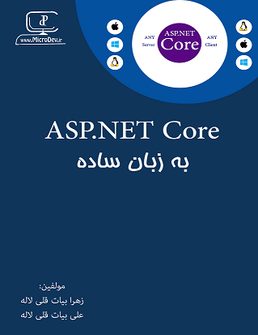

## Give a Star! :star:
If you like this project, learn something or you are using it in your applications, please give it a star. Thanks!

# ASP.NET Core in simple words

Welcome to the Git repo that is associated with the book
**[ASP.NET Core in simple words](https://github.com/ZahraBayatgh/MicrodevProject/raw/master/src/MicrodevProject/ASPNETCore-SecondEdition.pdf)**
published by [LinkedIn](https://www.linkedin.com/posts/alibayatgh_free-book-asp-net-core-in-simple-words-activity-6623602548404170752-An1q).
This book details how to use 
[ASP.NET Core](https://docs.microsoft.com/en-us/aspnet/core/?view=aspnetcore-3.1) (ASP.NET Core)
to develop web application in [.NET Core](https://www.microsoft.com/net) applications.

This Git repo contains all the code in the book, plus an
[free pdf book](https://github.com/ZahraBayatgh/MicrodevProject/raw/master/src/MicrodevProject/ASPNETCore-SecondEdition.pdf)
that I wrote, in persian.
All the code uses Microsoft's, open-source 
[Entity Framework Core](https://docs.microsoft.com/en-us/ef/core/index) library for database access.

To run the changed Git repo code you need to:

1. Install .NET Core 2.0 SDK – go to https://www.microsoft.com/net/download/core and select the correct SDK for your system
2. I recommend updating to Visual Studio 2017 15.3 or later as that has the new templates for ASP.NET Core 2.0.0. Or use Visual Studio code (the code is designed to work with either VS2017 or VSCode)

| ASP.NET Core in simple words |
| ------------|
|  |  |  |
|  <a href='https://github.com/ZahraBayatgh/MicrodevProject/raw/master/src/MicrodevProject/ASPNETCore-SecondEdition.pdf'>**Download .PDF**</a>   
